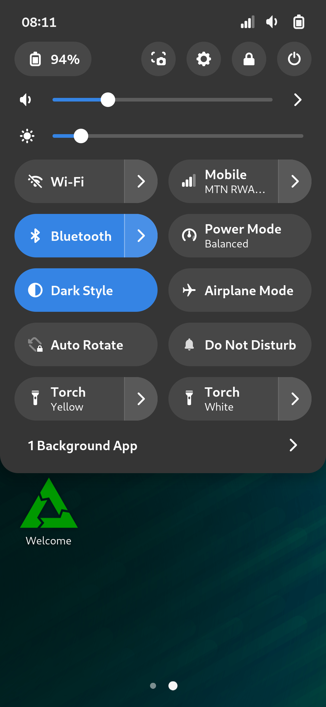

## Torch



A GNOME Shell extension that allows toggling and setting the brightness of
torches available on the system.

> **Note:** This extension was primarily made for
> [GNOME Shell Mobile](https://gitlab.gnome.org/verdre/gnome-shell-mobile)

## Install

To install this extension, clone this repo into `~/.local/share/gnome-shell/extensions/torch@vixalien.com`.

```sh
git clone https://github.com/vixalien/gnome-mobile-torch.git ~/.local/share/gnome-shell/extensions/torch@vixalien.com
```

## Update

```sh
cd ~/.local/share/gnome-shell/extensions/torch@vixalien.com && git pull
```

## Uninstall

```sh
rm -rf ~/.local/share/gnome-shell/extensions/torch@vixalien.com
```
